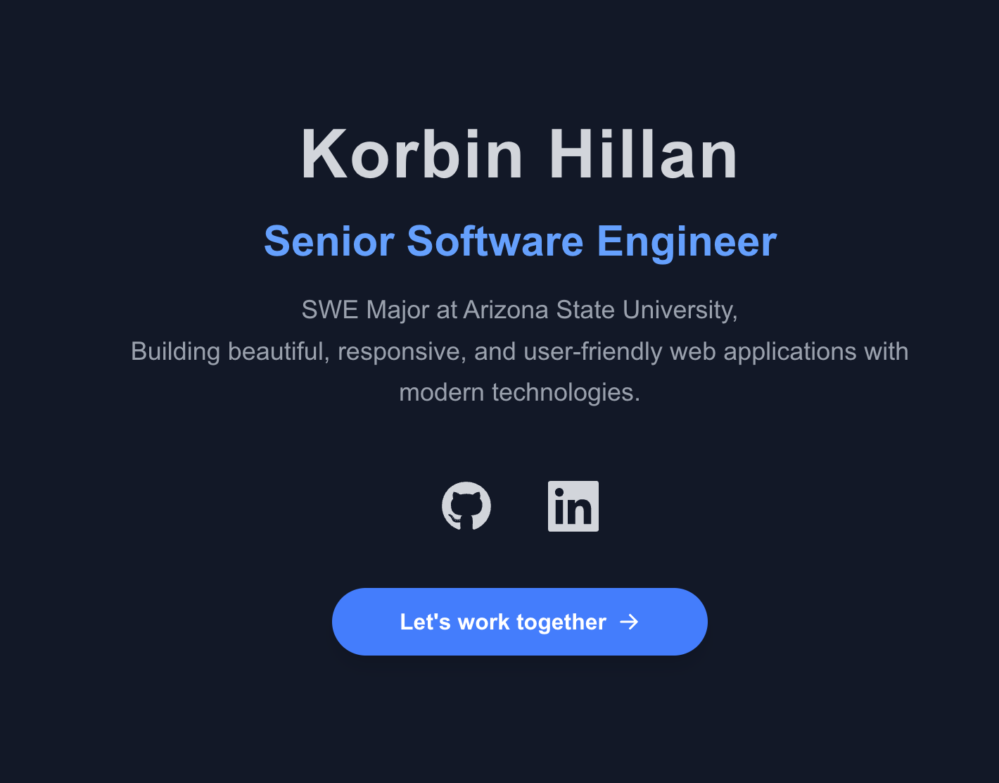
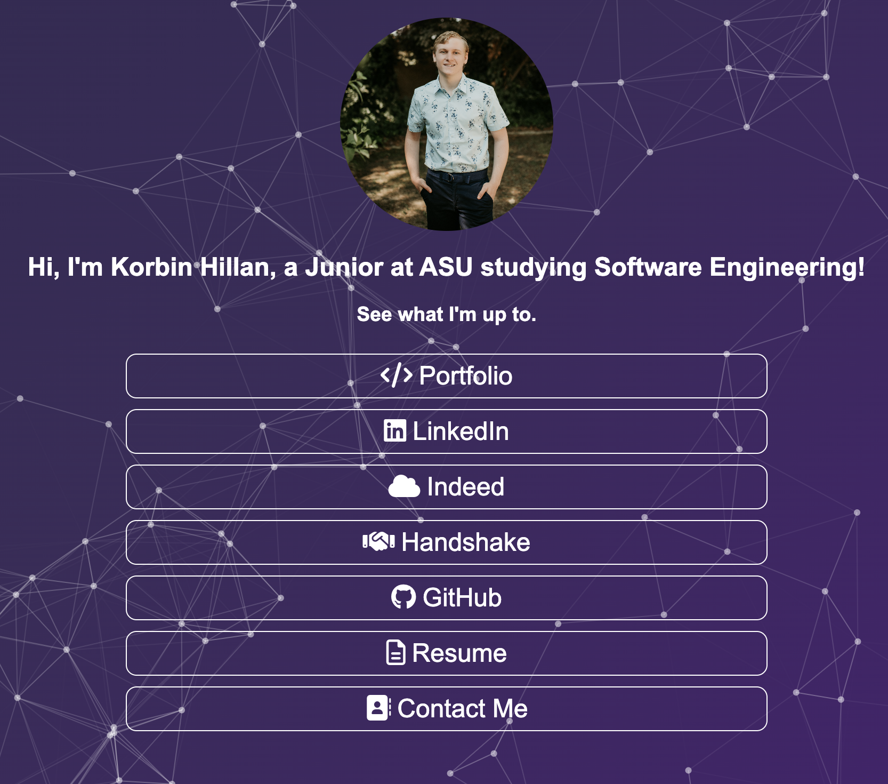

Portfolio (Next.js + Tailwind CSS)

Badges
- 
- 
- 
- 

Overview
- Modern, responsive developer portfolio featuring projects, resume, and blog.
- Built with Next.js and Tailwind CSS; uses both App Router (`src/app`) and Pages Router (`pages`).

Key Features
- Projects: Structured grid with case studies, status/category pills, and polished actions (Case Study, Code, Live).
- Resume: Professional layout with View PDF (modal), Download, and Print. Place your PDF at `public/Korbin_Resume.pdf`.
- Blog: Data‑driven posts with search, category filters, index page, and per‑post detail routes.
- Footer: Simplified, accessible footer with essential links and social icons.
- Tech Stack section: Toned‑down cards, expanded Development Tools (CI/CD, testing, DevOps).

Live + Repos
- Portfolio live: https://korbinhillan.com
- Portfolio repo: https://github.com/Korbin-Hillan/Portfolio
- Linktree live: https://korbinhillanlinktree.netlify.app/
- Linktree repo: https://github.com/Korbin-Hillan/Linktree

Getting Started
- Install deps: `npm install`
- Dev server: `npm run dev` (opens http://localhost:3000)
- Build: `npm run build`
- Start (prod): `npm start`

Project Structure
- `src/app/` — App Router pages (home, projects, projects/[slug])
- `pages/` — Pages Router (resume, blog, blog/[slug])
- `components/` — UI components (header, footer, sections)
- `src/data/` — Content data sources
  - `projects.js` — Projects and case-study copy
  - `blog.js` — Blog posts (title, excerpt, date, tags, content, slug)
- `public/` — Static assets and resume PDF (`Korbin_Resume.pdf`)

Content Management
- Projects
  - Edit `src/data/projects.js` to add/update items.
  - Fields: `title, slug, image, description, impact, status, date, client, category, technologies[], repo, live, pitch, problem, solution, outcomes[]`.

- Blog
  - Edit `src/data/blog.js` to add posts.
  - Fields: `title, excerpt, date, readTime, category, tags[], slug, content[]`.
  - Index route: `/blog` (search + category filters). Post route: `/blog/[slug]`.

- Resume
  - Page: `pages/resume.jsx`
  - PDF actions: View (modal), Download, Print.
  - Place file at `public/Korbin_Resume.pdf` to enable view/download.

Contact Form (Email)
- The contact form supports two modes:
  1) Formspree (recommended, no server needed):
     - Create a form at https://formspree.io, copy your Form ID (e.g., `xyzabcd`)
     - Set env var `NEXT_PUBLIC_FORMSPREE_ID=xyzabcd` in `.env.local`
     - The client will POST to `https://formspree.io/f/xyzabcd`.
  2) Fallback mailto: If `NEXT_PUBLIC_FORMSPREE_ID` is not set, the form opens the default mail client with a prefilled email to `khillan@asu.edu`.
- Code: `components/contact.jsx` (see `handleSubmit`).

Styling/Framework
- Next.js (React) with Tailwind CSS.
- Icons via `react-icons`.

Customization Quick Links
- Footer: `components/footer.jsx`
- Projects layout: `src/app/projects/page.js`
- Project case study: `src/app/projects/[slug]/page.js`
- Blog section (home): `components/blog.jsx`
- Blog index: `pages/blog.jsx`
- Blog post: `pages/blog/[slug].jsx`
- Resume: `pages/resume.jsx`

Deploy
- Optimized for Vercel. Build with `npm run build` and deploy the output.

Notes
- Some routes use Pages Router to keep things simple (resume, blog); others use App Router.
- Add real screenshots to `public/images/` and update `image` fields in `src/data/projects.js` for best appearance.

Screenshots
- Portfolio

  

- Linktree

  

Optional Demo GIF
- Add a short demo GIF at `public/images/demo.gif`, then embed:

  ``
